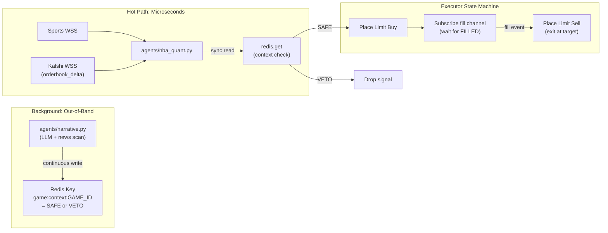
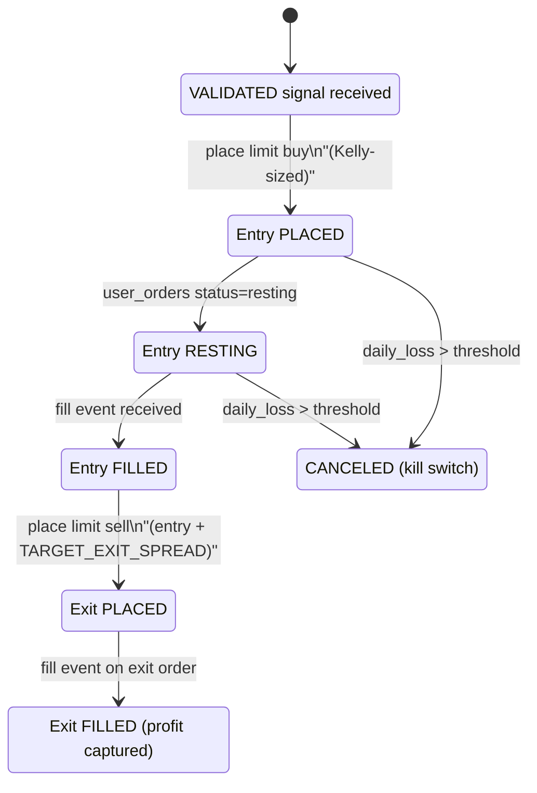

# Argus: System Architecture

## Invariants

- **Fail-close**: if `redis.get("game:context:{game_id}")` returns `None` (key expired, Narrative crashed, LLM down), the Quant Engine treats it as `VETO`. The system never trades blind.
- **No REST in the hot path**: the Executor caches bankroll via a background poll loop (`get_balance()` every 10s). Kelly sizing uses `self.current_bankroll` -- no HTTP call at execution time. Being off by a few dollars on bankroll is acceptable; missing a trade by 200ms is not.
- **No LLM in the hot path**: context is pre-computed out-of-band and read as a Redis key.
- **No selling unowned contracts**: exit orders dispatch only after a Kalshi `fill` WS event confirms inventory.

## Signal Flow



The Narrative Agent runs entirely out-of-band. It never sits in the trade execution path. Instead, it continuously monitors news/play-by-play and maintains a Redis context cache. The Quant Engine reads this cache synchronously (microsecond `redis.get`) when it detects a +EV anomaly -- no LLM latency in the hot path.

The Executor never sells contracts it doesn't own. It subscribes to Kalshi's WebSocket `fill` channel and only dispatches the paired exit sell after receiving a fill confirmation with `post_position > 0`.

## Kalshi WebSocket Channels

A single authenticated connection to `wss://api.elections.kalshi.com/trade-api/ws/v2` multiplexes four channels:

- **`orderbook_delta`** (private) -- real-time order book snapshots and deltas for target markets
- **`ticker`** (public) -- backup price feed with `yes_bid`, `yes_ask`, `volume`
- **`fill`** (private) -- immediate fill notifications with `trade_id`, `order_id`, `market_ticker`, `yes_price`, `count`, `post_position`, `action`, `is_taker`
- **`user_orders`** (private) -- order status transitions (`resting` -> `executed` / `canceled`) with `fill_count_fp`, `remaining_count_fp`; used as reconciliation fallback

## Module Map

### `requirements.txt`

```
kalshi-python-async>=2.0.0
pydantic>=2.0.0
pydantic-settings
redis[hiredis]>=5.0.0
uvloop
websockets
aiohttp
pandas
numpy
loguru
python-dotenv
telegram-send
cryptography
```

### `core/schemas.py` -- Pydantic Models

- **`SignalStatus`** -- enum: `PENDING_BUY`, `VALIDATED`, `VETOED`, `EXECUTED`
- **`ContextStatus`** -- enum: `SAFE`, `VETO` (what gets written to the Redis context cache)
- **`Signal`** -- `ticker`, `action`, `side`, `status: SignalStatus`, `confidence` (0.0-1.0), `source`, `ev_estimate`, `entry_price`, `exit_price`, `veto_reason` (optional), `game_id`, `timestamp`
- **`GameState`** -- `game_id`, `home_team`, `away_team`, `home_score`, `away_score`, `quarter`, `clock`, `timestamp`
- **`MarketState`** -- `ticker`, `yes_bid`, `yes_ask`, `no_bid`, `no_ask`, `volume`, `timestamp`
- **`Order`** -- `ticker`, `action`, `side`, `count` (Kelly-computed), `type` (frozen "limit"), `yes_price`/`no_price`, `client_order_id` (auto UUID)
- **`OrderState`** -- enum: `PLACED`, `RESTING`, `FILLED`, `PARTIALLY_FILLED`, `CANCELED` (executor state machine states)
- **`ManagedOrder`** -- wraps `Order` + `OrderState` + `fill_count`, `remaining_count`, `kalshi_order_id`, `paired_exit_order_id` (optional) -- the executor's internal tracking model
- **`AppSettings`** -- `pydantic-settings` BaseSettings: `KALSHI_API_KEY_ID`, `KALSHI_PRIVATE_KEY_PATH`, `REDIS_URL`, `SPORTS_API_KEY`, `SPORTS_API_WS_URL`, `OPENAI_API_KEY`, `OPENAI_MODEL`, `TELEGRAM_CHAT_ID`, `DAILY_STOP_LOSS_USD`, `SLIPPAGE_TICKS`, `KELLY_FRACTION`, `TARGET_EXIT_SPREAD`, `CONTEXT_POLL_INTERVAL`, `BALANCE_POLL_INTERVAL`

### `core/bus.py` -- Redis Signal Bus + Context Cache

Async `redis.asyncio` wrapper with two distinct roles:

**Pub/Sub channels** (event-driven):

- `game:state` -- live game state from sports watcher
- `market:state` -- live order book from Kalshi watcher
- `signal:validated` -- signals that passed context check (Quant publishes directly)
- `signal:executed` -- execution confirmations
- `signal:heartbeat` -- agent health

**Key-value context cache** (synchronous reads):

- `game:context:{game_id}` -- string value `SAFE` or `VETO:{reason}`, written by Narrative Agent, read by Quant Engine
- `set_context(game_id, status, reason)` / `get_context(game_id) -> ContextStatus`
- TTL on context keys (5 minutes default) so stale context auto-expires

### `core/client.py` -- Kalshi Client (REST + WebSocket Auth)

- `KalshiAsyncClient` wraps `kalshi-python-async` for REST: `place_order()`, `cancel_order()`, `get_positions()`, `get_balance()`
- `sign_ws_headers() -> dict` -- generates RSA-PSS auth headers for WS handshake
- `get_ws_url() -> str` -- returns production or demo WS URL based on settings
- Retry with exponential backoff on transient REST failures

### `core/base_agent.py` -- BaseAgent ABC

- `__init__(name, settings, bus, client)` -- loguru sink to `logs/{name}.log` + stderr
- `abstract async run()` -- main loop
- `async heartbeat()` -- publishes to `signal:heartbeat`
- `async start()` -- installs `uvloop`, runs `heartbeat` + `run` via `asyncio.gather`

### `watchers/sports_feed.py` -- Sports Data Watcher

- **`SportsFeed`** -- ABC with `async connect()`, `async listen()` yielding `GameState`
- **`APISportsFeed(SportsFeed)`** -- WebSocket to API-SPORTS, publishes `GameState` to `game:state`
- **`BalldontlieFeed(SportsFeed)`** -- REST polling, research/backtest only, marked non-production
- Pluggable: swap to Sportradar/LSports by adding a subclass

### `watchers/kalshi_feed.py` -- Kalshi Order Book + Fill Watcher

Single authenticated WebSocket connection to `wss://api.elections.kalshi.com/trade-api/ws/v2`. Subscribes to four channels:

- **`orderbook_delta`** -- maintains local order book, publishes `MarketState` to `market:state`
- **`ticker`** (public) -- backup price feed
- **`fill`** (private) -- pushes fill events to executor via internal callback/queue
- **`user_orders`** (private) -- reconciliation of order status (`resting`/`executed`/`canceled`)

Exposes `on_fill(callback)` and `on_order_update(callback)` for the executor to register handlers.

### `agents/nba_quant.py` -- Quant Trigger

Subscribes to `game:state` and `market:state`. The entire hot path runs without any async I/O to external services:

1. On each game/market update, compute implied probability from Kalshi bid/ask
2. Compute model probability from game state using pre-loaded historical reversal data
3. If `model_prob * payout - entry_price > EV_THRESHOLD`:
   - Synchronous `redis.get("game:context:{game_id}")` -- microsecond cache read
   - If `SAFE`: publish `Signal(status=VALIDATED)` directly to `signal:validated`
   - If `VETO`: log reason and drop
   - If `None` (key expired / missing): treat as `VETO` (fail-close). Log warning that context is stale or Narrative is down. Never trade blind.

### `agents/narrative.py` -- Out-of-Band Context Monitor

Runs independently in a background loop, never in the trade execution path:

1. Monitors active games (reads `game:state` for game IDs)
2. Every N seconds (`CONTEXT_POLL_INTERVAL`), queries LLM: *"Is there critical negative context (injuries, ejections, technical fouls) for {team} in the last 3 minutes?"*
3. Writes result to Redis: `redis.set("game:context:{game_id}", "SAFE", ex=300)` or `redis.set("game:context:{game_id}", "VETO:Curry limped off at 4:32 Q3", ex=300)`
4. On critical events (star player injury), immediately writes `VETO` without waiting for poll interval
5. Built behind `LLMProvider` interface (pluggable: OpenAI / Anthropic / Gemini)

### `agents/executor.py` -- Fill-Aware Execution State Machine

The executor manages the full order lifecycle. Internal state per trade:



Key behaviors:

- Subscribes to `signal:validated` on Redis for incoming trade signals
- Registers `on_fill` and `on_order_update` callbacks with `kalshi_feed.py`
- **Background balance tracking**: a background async loop polls `get_balance()` every 10 seconds and stores it in `self.current_bankroll`. No REST call at execution time.
- **Kelly sizing**: `count = floor(kelly_fraction * self.current_bankroll * edge / odds)` -- instant calculation using cached bankroll
- **Entry**: limit buy at `entry_price + SLIPPAGE_TICKS`
- **Exit**: only dispatched after `fill` event confirms inventory; limit sell at `entry_price + TARGET_EXIT_SPREAD`
- **Kill switch**: tracks `daily_realized_loss`; if exceeded, cancels all resting orders, halts new trades, sends Telegram alert
- Publishes `Signal(status=EXECUTED)` to `signal:executed` for audit trail

### `main.py` -- Entrypoint

- Loads `AppSettings` from `.env`
- Instantiates `SignalBus`, `KalshiAsyncClient`
- Wires the `KalshiFeedWatcher`'s fill/order callbacks to the `OrderExecutor`
- Launches all concurrently via `asyncio.gather`:
  - `SportsFeedWatcher`
  - `KalshiFeedWatcher`
  - `NBAQuantAgent`
  - `NarrativeAgent` (background)
  - `OrderExecutor`
- Graceful shutdown on SIGINT/SIGTERM: cancel resting orders, flush logs

## Key Design Decisions

- **Zero REST in hot path** -- bankroll is background-cached; context is a Redis key read; no HTTP calls between +EV detection and order placement
- **Fail-close on missing context** -- `None` from Redis = `VETO`; the system never trades without a confirmed `SAFE` from the Narrative Agent
- **Single Kalshi WS connection** -- multiplexes `orderbook_delta`, `ticker`, `fill`, `user_orders` on one auth'd socket
- **Limit orders only** -- `Order.type` frozen to `"limit"`, no market order codepath exists
- **Context cache with TTL** -- stale context auto-expires (5min default); expiration triggers fail-close
- **Half-Kelly default** -- conservative position sizing to survive variance
- **Pluggable interfaces** -- `SportsFeed` and `LLMProvider` are ABCs, swap providers by subclassing
- **Balldontlie is research-only** -- never used for live trading, only historical backtest data

## Capital Rebalancing (Opportunity Cost Engine)

When the Quant Agent detects a +EV anomaly but the bankroll is insufficient, it evaluates whether liquidating an existing deep-in-the-money position would yield strictly more profit than holding it.

**Signal flow:**

1. `OrderExecutor` publishes `portfolio:state` (bankroll + resting exits) to Redis every balance poll interval
2. `NBAQuantAgent` subscribes to `portfolio:state` and caches it locally
3. On a new +EV signal with insufficient bankroll, the quant agent evaluates each resting exit:
   - Only positions with `live_bid >= MIN_REALLOCATE_BID` (default 90c) are considered
   - Calculates freed capital and projects a Kelly-sized new trade count
   - Compares `total_new_ev_cents` against `foregone_profit + taker_fees`
4. If the hurdle clears, publishes `Signal(status=REALLOCATE, target_order_id=...)` to `signal:reallocate`
5. `OrderExecutor` cancels the specific resting exit by `target_order_id`, waits 500ms for exchange inventory settlement, then places an aggressive limit sell at the current bid

**Invariants:**

- Hurdle rate is unit-correct: total projected EV (from freed capital) vs total foregone profit + fees
- `target_order_id` ensures exact order targeting when multiple partial-fill exits exist for the same ticker
- 500ms settle delay between cancel and aggressive sell prevents Kalshi 400 errors from insufficient inventory
- The new buy signal is NOT published during reallocation -- the next WS tick naturally re-detects the anomaly once capital frees up
