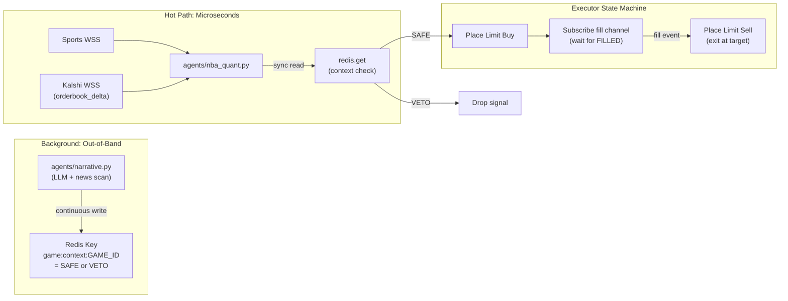
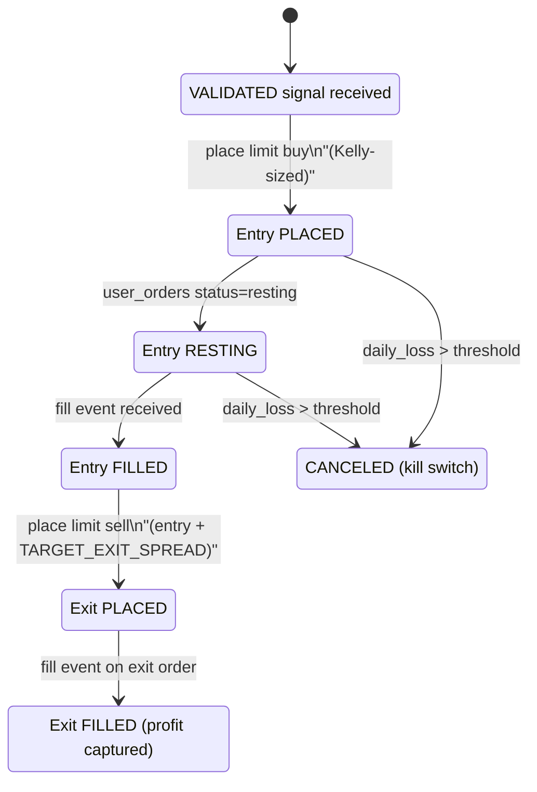

# Argus: System Architecture

## Invariants

- **Fail-close**: if `redis.get("game:context:{game_id}")` returns `None` (key expired, Narrative crashed, LLM down), the Quant Engine treats it as `VETO`. The system never trades blind.
- **No REST in the hot path**: the Executor caches bankroll via a background poll loop (`get_balance()` every 10s). Kelly sizing uses `self.current_bankroll` -- no HTTP call at execution time. Being off by a few dollars on bankroll is acceptable; missing a trade by 200ms is not.
- **No LLM in the hot path**: context is pre-computed out-of-band and read as a Redis key.
- **No selling unowned contracts**: exit orders dispatch only after a Kalshi `fill` WS event confirms inventory.

## Signal Flow



The Narrative Agent runs in the background, not in the trade path. It polls the LLM, writes SAFE/VETO to Redis, and the quant agent reads that key when it finds a +EV anomaly. No LLM call blocks a trade.

The Executor won't sell contracts it doesn't own. It waits for a Kalshi fill event before placing the exit order.

## Kalshi WebSocket Channels

A single authenticated connection to `wss://api.elections.kalshi.com/trade-api/ws/v2` multiplexes four channels:

- **`orderbook_delta`** (private) -- real-time order book snapshots and deltas for target markets
- **`ticker`** (public) -- backup price feed with `yes_bid`, `yes_ask`, `volume`
- **`fill`** (private) -- immediate fill notifications with `trade_id`, `order_id`, `market_ticker`, `yes_price`, `count`, `post_position`, `action`, `is_taker`
- **`user_orders`** (private) -- order status transitions (`resting` -> `executed` / `canceled`) with `fill_count_fp`, `remaining_count_fp`; used as reconciliation fallback

## Module Map

### `requirements.txt`

```
kalshi-python-async>=2.0.0
pydantic>=2.0.0
pydantic-settings
redis[hiredis]>=5.0.0
uvloop
websockets
aiohttp
pandas
numpy
loguru
python-dotenv
telegram-send
cryptography
```

### `core/schemas.py` -- Pydantic Models

- **`SignalStatus`** -- `PENDING_BUY`, `VALIDATED`, `VETOED`, `EXECUTED`, `REALLOCATE`
- **`ContextStatus`** -- `SAFE`, `VETO`
- **`Signal`** -- the object that flows through the bus. Has `ticker`, `action`, `side`, `status`, `confidence`, `source` (which strategy produced it), `ev_estimate`, `entry_price`, `exit_price`, `game_id`, `target_order_id` (for reallocation), `timestamp`
- **`GameState`** -- `game_id`, `home_team`, `away_team`, `home_abbr`, `away_abbr`, `home_score`, `away_score`, `quarter`, `clock`, `timestamp`
- **`MarketState`** -- `ticker`, `yes_bid`, `yes_ask`, `no_bid`, `no_ask`, `volume`, `timestamp`
- **`Order`** -- `ticker`, `action`, `side`, `count`, `type` (frozen to "limit"), `yes_price`/`no_price`, `client_order_id`
- **`ManagedOrder`** -- wraps `Order` with execution state: `state`, `fill_count`, `remaining_count`, `vwap_cents`, `is_exit`, `parent_entry_id`, `paired_exit_order_ids`, `created_at`
- **`PortfolioPosition`** / **`PortfolioState`** -- published by the executor so the quant agent knows what's resting and how much bankroll is left
- **`AppSettings`** -- everything from `.env`: Kalshi keys, Redis URL, LLM config, kill switch, Kelly fraction, reallocation thresholds, poll intervals

### `core/bus.py` -- Redis Signal Bus + Context Cache

Async `redis.asyncio` wrapper with two distinct roles:

**Pub/Sub channels** (event-driven):

- `game:state` -- live game state from the sports watcher
- `market:state` -- live order book from the Kalshi watcher
- `signal:validated` -- quant agent fires these when a strategy finds +EV and context is SAFE
- `signal:executed` -- executor publishes after a fill completes
- `signal:reallocate` -- quant agent asks the executor to liquidate a position for a better opportunity
- `signal:heartbeat` -- each agent pings this so the monitor knows they're alive
- `portfolio:state` -- executor broadcasts bankroll + resting exits so the quant agent can check capital

**Key-value context cache** (synchronous reads):

- `game:context:{game_id}` -- string value `SAFE` or `VETO:{reason}`, written by Narrative Agent, read by Quant Engine
- `set_context(game_id, status, reason)` / `get_context(game_id) -> ContextStatus`
- TTL on context keys (5 minutes default) so stale context auto-expires

### `core/client.py` -- Kalshi Client (REST + WebSocket Auth)

- `KalshiAsyncClient` wraps `kalshi-python-async` for REST: `place_order()`, `cancel_order()`, `get_positions()`, `get_balance()`
- `sign_ws_headers() -> dict` -- generates RSA-PSS auth headers for WS handshake
- `get_ws_url() -> str` -- returns production or demo WS URL based on settings
- Retry with exponential backoff on transient REST failures

### `core/base_agent.py` -- BaseAgent ABC

- `__init__(name, settings, bus, client)` -- loguru sink to `logs/{name}.log` + stderr
- `abstract async run()` -- main loop
- `async heartbeat()` -- publishes to `signal:heartbeat`
- `async start()` -- installs `uvloop`, runs `heartbeat` + `run` via `asyncio.gather`

### `watchers/sports_feed.py` -- Sports Data Watcher

- **`SportsFeed`** -- ABC with `async connect()`, `async listen()` yielding `GameState`
- **`APISportsFeed(SportsFeed)`** -- WebSocket to API-SPORTS, publishes `GameState` to `game:state`
- **`BalldontlieFeed(SportsFeed)`** -- REST polling, research/backtest only, marked non-production
- Pluggable: swap to Sportradar/LSports by adding a subclass

### `watchers/kalshi_feed.py` -- Kalshi Order Book + Fill Watcher

Single authenticated WebSocket connection to `wss://api.elections.kalshi.com/trade-api/ws/v2`. Subscribes to four channels:

- **`orderbook_delta`** -- maintains local order book, publishes `MarketState` to `market:state`
- **`ticker`** (public) -- backup price feed
- **`fill`** (private) -- pushes fill events to executor via internal callback/queue
- **`user_orders`** (private) -- reconciliation of order status (`resting`/`executed`/`canceled`)

Exposes `on_fill(callback)` and `on_order_update(callback)` for the executor to register handlers.

### `agents/nba_quant.py` -- OmniQuant Agent (Strategy Pattern)

Multi-strategy portfolio manager. Subscribes to `game:state`, `market:state`, and `portfolio:state`. Uses a pluggable Strategy Pattern:

**Architecture:**
- `agents/strategies/base.py` -- `BaseStrategy` ABC with `can_evaluate(market)` and `evaluate(game, market) -> Signal | None`
- `agents/strategies/moneyline.py` -- Logistic reversal model for game-winner (GAME) tickers. Directional: resolves which team the ticker targets.
- `agents/strategies/totals.py` -- Pace projection model for over/under (TOTAL) tickers. Projects final score from current pace, compares to Kalshi line.

**Evaluation flow (no external async I/O in the hot path):**

1. On each game/market update, auto-map games to all matching KXNBA tickers (multiple per game: moneyline, totals, spreads)
2. For each game, fan out to all registered strategies across all mapped markets
3. Collect proposals, rank by EV (highest first)
4. Take the best proposal and run it through the context + cooldown + capital pipeline:
   - Synchronous `redis.get("game:context:{game_id}")` -- fail-close if missing
   - 60-second per-ticker cooldown to prevent signal spam
   - If bankroll insufficient, evaluate reallocation hurdle rate
5. If all checks pass, publish `Signal(status=VALIDATED)` to `signal:validated`

**Adding a new strategy:** Create a new file in `agents/strategies/`, implement `BaseStrategy`, and add it to the `strategies` list in the `NBAQuantAgent` constructor. No changes to the agent itself.

### `agents/narrative.py` -- Context Monitor

Background loop that asks the LLM whether anything bad is happening in each active game (injuries, ejections, etc.). Writes SAFE or VETO to a Redis key with a 5-minute TTL. If it crashes or the LLM goes down, the keys expire and the quant agent treats missing context as VETO.

Swappable LLM backend -- `LLMProvider` interface with OpenAI, Anthropic, and Gemini implementations. Set `LLM_PROVIDER` in `.env` to switch.

### `agents/executor.py` -- Fill-Aware Execution State Machine

The executor manages the full order lifecycle. Internal state per trade:



Key behaviors:

- Subscribes to `signal:validated` on Redis for incoming trade signals
- Registers `on_fill` and `on_order_update` callbacks with `kalshi_feed.py`
- **Background balance tracking**: a background async loop polls `get_balance()` every 10 seconds and stores it in `self.current_bankroll`. No REST call at execution time.
- **Kelly sizing**: `count = floor(kelly_fraction * self.current_bankroll * edge / odds)` -- instant calculation using cached bankroll
- **Entry**: limit buy at `entry_price + SLIPPAGE_TICKS`
- **Exit**: only dispatched after `fill` event confirms inventory; limit sell at `entry_price + TARGET_EXIT_SPREAD`
- **Kill switch**: tracks `daily_realized_loss`; if exceeded, cancels all resting orders, halts new trades, sends Telegram alert
- Publishes `Signal(status=EXECUTED)` to `signal:executed` for audit trail

### `main.py` -- Entrypoint

- Loads `AppSettings` from `.env`
- Instantiates `SignalBus`, `KalshiAsyncClient`
- Wires the `KalshiFeedWatcher`'s fill/order callbacks to the `OrderExecutor`
- Launches all concurrently via `asyncio.gather`:
  - `SportsFeedWatcher`
  - `KalshiFeedWatcher`
  - `NBAQuantAgent`
  - `NarrativeAgent` (background)
  - `OrderExecutor`
- Graceful shutdown on SIGINT/SIGTERM: cancel resting orders, flush logs

## Design Decisions

- No HTTP calls in the trade path. Bankroll is cached, context is a Redis key. The only thing between "+EV detected" and "order placed" is a Redis read and some arithmetic.
- Missing context = VETO. If the LLM is down or the key expired, the bot stops trading. It doesn't guess.
- One Kalshi WebSocket connection handles everything: order book, fills, order status.
- Limit orders only. There's no market order codepath anywhere in the system.
- Context keys have a 5-minute TTL. If the Narrative Agent dies, keys expire and the bot stops on its own.
- Half-Kelly by default. Conservative sizing so a bad night doesn't wipe you out.
- `SportsFeed` and `LLMProvider` are interfaces. Swap Balldontlie for Sportradar, or Gemini for Claude, by writing a subclass.
- Strategies are pluggable too. Drop a new file in `agents/strategies/`, implement `BaseStrategy`, add it to the constructor list.

## Capital Rebalancing (Opportunity Cost Engine)

When the Quant Agent detects a +EV anomaly but the bankroll is insufficient, it evaluates whether liquidating an existing deep-in-the-money position would yield strictly more profit than holding it.

**Signal flow:**

1. `OrderExecutor` publishes `portfolio:state` (bankroll + resting exits) to Redis every balance poll interval
2. `NBAQuantAgent` subscribes to `portfolio:state` and caches it locally
3. On a new +EV signal with insufficient bankroll, the quant agent evaluates each resting exit:
   - Only positions with `live_bid >= MIN_REALLOCATE_BID` (default 90c) are considered
   - Calculates freed capital and projects a Kelly-sized new trade count
   - Compares `total_new_ev_cents` against `foregone_profit + taker_fees`
4. If the hurdle clears, publishes `Signal(status=REALLOCATE, target_order_id=...)` to `signal:reallocate`
5. `OrderExecutor` cancels the specific resting exit by `target_order_id`, waits 500ms for exchange inventory settlement, then places an aggressive limit sell at the current bid

**Invariants:**

- Hurdle rate is unit-correct: total projected EV (from freed capital) vs total foregone profit + fees
- `target_order_id` ensures exact order targeting when multiple partial-fill exits exist for the same ticker
- 500ms settle delay between cancel and aggressive sell prevents Kalshi 400 errors from insufficient inventory
- The new buy signal is NOT published during reallocation -- the next WS tick naturally re-detects the anomaly once capital frees up
