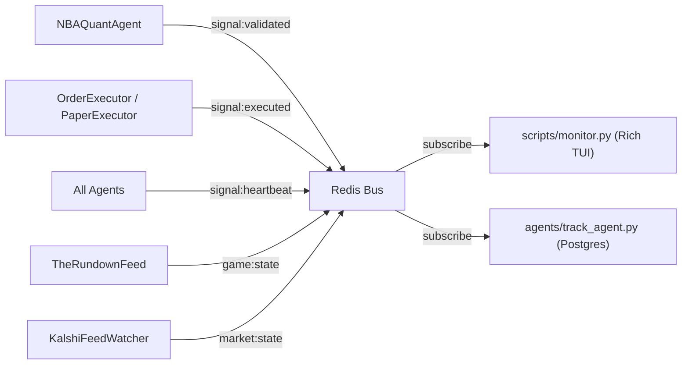

# Real-Time Monitoring and Trade Tracking

## Data flow

The monitor and tracker are both **read-only Redis observers** -- they subscribe to the same pub/sub channels the trading loop uses, but never publish or mutate state.



## Part 1: Rich Terminal Dashboard -- `scripts/monitor.py`

A standalone script that connects to the same Redis instance and renders a four-panel terminal UI:

**Panel layout:**

- **Header bar** -- Live Kalshi balance (polled every 30s via REST), session P&L (from real entry/exit fills), win rate (W-L), open position count, signals seen, kill switch limit, environment (demo/prod)
- **Event feed** (left) -- scrolling table of the last 20 `signal:validated` and `signal:executed` events with time, market, details, and realized P&L
- **System health** (right) -- two sections:
  - *Data feeds*: Sports Feed, Kalshi WS, and LLM/Narrative — each shows **OK** (green, <60s since last data), **STALE** (yellow, <5min), or **DOWN** (red, >5min) based on last observed message timestamp
  - *Agent heartbeats*: `nba_quant`, `executor`, `paper_executor`, `track` — shows OK or waiting based on `signal:heartbeat`
- **Active games** (bottom) -- game state from `game:state` with score, quarter, clock, and live SAFE/VETO context status read from Redis

**Channels subscribed:** `signal:validated`, `signal:executed`, `signal:reallocate`, `signal:heartbeat`, `game:state`, `market:state`, `portfolio:state`

**Key implementation details:**

- Uses `rich.live.Live` with `refresh_per_second=2` for smooth TUI updates
- **Real P&L**: session P&L is computed from actual fill prices `(exit_price - entry_price) / 100`, not `ev_estimate`
- **Live balance**: a background task polls `KalshiAsyncClient.get_balance()` and `get_positions()` every 30 seconds, independent of the Redis bus. Also updates from `portfolio:state` messages when the executor publishes them
- **Feed health tracking**: timestamps when data last arrived on `game:state` (sports), `market:state` (Kalshi WS), and `signal:heartbeat` from the `narrative` agent (LLM). Staleness thresholds: OK <60s, STALE <5min, DOWN >5min
- Reads `game:context:{game_id}` via `bus.get_context()` for live SAFE/VETO display
- Graceful shutdown on SIGINT/SIGTERM cleans up the Redis subscription and Kalshi client
- Runs completely independently of `main.py` -- no trading code imported, no side effects

**Usage:**

```bash
# Local
python -m scripts.monitor

# Docker (must be interactive -- Rich needs a TTY)
docker-compose run --rm argus-monitor
```

## Part 2: Trade Tracker -- `agents/track_agent.py`

A `BaseAgent` subclass that subscribes to `signal:validated` and `signal:executed`, then persists every event to a PostgreSQL database.

### Paper/Live data isolation

Every row includes an `is_paper` boolean column. The `TrackAgent` receives the paper mode flag at init time (passed from `main.py`'s `--paper` argument) and tags every INSERT. This prevents data pollution when switching between `--paper` and live modes against the same environment. Historical analysis queries should always filter with `WHERE is_paper = FALSE` (or `= TRUE` for paper-only review).

### Schema

```sql
CREATE TABLE IF NOT EXISTS trades (
    id          SERIAL PRIMARY KEY,
    signal_id   TEXT    UNIQUE,
    ticker      TEXT    NOT NULL,
    side        TEXT    NOT NULL,
    status      TEXT    NOT NULL,
    confidence  DOUBLE PRECISION,
    ev_estimate DOUBLE PRECISION,
    entry_price INTEGER,
    exit_price  INTEGER,
    game_id     TEXT,
    source      TEXT,
    pnl_dollars DOUBLE PRECISION DEFAULT 0.0,
    is_paper    BOOLEAN NOT NULL DEFAULT FALSE,
    created_at  TIMESTAMPTZ NOT NULL
);
CREATE INDEX IF NOT EXISTS idx_trades_ticker ON trades(ticker);
CREATE INDEX IF NOT EXISTS idx_trades_is_paper ON trades(is_paper);
CREATE INDEX IF NOT EXISTS idx_trades_created_at ON trades(created_at);
CREATE INDEX IF NOT EXISTS idx_trades_status ON trades(status);
```

### Write behavior

- On `signal:validated`: INSERT a new row with status=VALIDATED, pnl=0, is_paper from init flag
- On `signal:executed`: UPDATE the matching `signal_id` row to status=EXECUTED with real fill-based P&L computed from `(exit_price - entry_price) / 100`, not `ev_estimate`. If no matching row exists (edge case: tracker started after validation), INSERT directly.
- Uses `asyncpg` for high-performance async Postgres I/O within the asyncio event loop
- Runs as an optional agent, wired into `main.py` with a `--track` flag

### Reporting

A CLI report script queries Postgres and prints lifetime stats, per-strategy breakdown, per-game breakdown, top tickers, hourly distribution, and daily P&L.

```bash
# Quick report (via Docker)
./report.sh
./report.sh --paper
./report.sh --days 7

# Local (needs DATABASE_URL env var or defaults to localhost)
python -m scripts.report
```

### Migration from SQLite

If upgrading from an older version that used SQLite (`data/trades.db`), run the one-shot migration:

```bash
docker-compose up -d postgres
docker-compose run --rm --entrypoint "" argus python -m scripts.migrate_to_pg
```

This reads all rows from the local SQLite file and inserts them into Postgres, skipping duplicates by `signal_id`.

## Part 3: Docker configuration

The `argus-monitor` service in `docker-compose.yml` requires `tty: true` and `stdin_open: true` because `rich.live.Live` needs a pseudo-TTY to calculate screen dimensions. Without these flags, Docker renders the output as mangled ANSI escape codes.

Run interactively (not detached):

```bash
docker-compose run --rm argus-monitor
```
