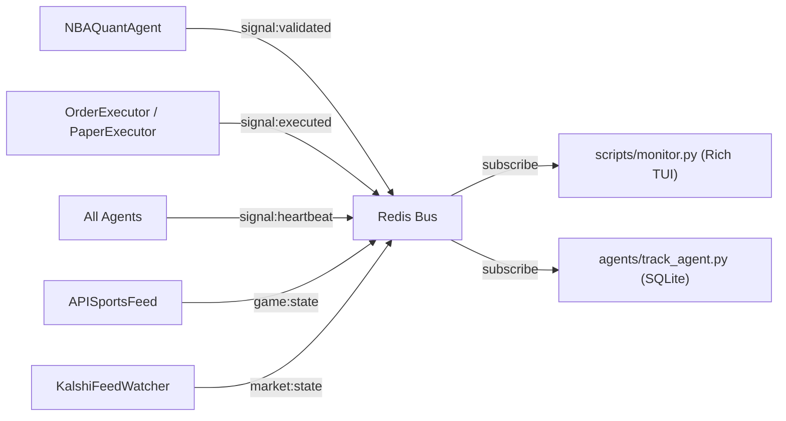

# Real-Time Monitoring and Trade Tracking

## Data flow

The monitor and tracker are both **read-only Redis observers** -- they subscribe to the same pub/sub channels the trading loop uses, but never publish or mutate state.



## Part 1: Rich Terminal Dashboard -- `scripts/monitor.py`

A standalone script that connects to the same Redis instance and renders a four-panel terminal UI:

**Panel layout:**

- **Header bar** -- Daily P&L (colored), win rate (W-L), signals seen, kill switch limit, environment (demo/prod)
- **Event feed** (left) -- scrolling table of the last 20 `signal:validated` and `signal:executed` events with time, market, details, and realized P&L
- **Agent health** (right) -- table of each agent's last heartbeat timestamp from `signal:heartbeat`
- **Active games** (bottom) -- game state from `game:state` with score, quarter, clock, and live SAFE/VETO context status read from Redis

**Channels subscribed:** `signal:validated`, `signal:executed`, `signal:heartbeat`, `game:state`, `market:state`

**Key implementation details:**

- Uses `rich.live.Live` with `refresh_per_second=2` for smooth TUI updates
- Reads the `Signal` schema fields directly: `ev_estimate` is P&L on `EXECUTED` signals, `ev_estimate`/`confidence` for `VALIDATED` signals
- Reads `game:context:{game_id}` via `bus.get_context()` for live SAFE/VETO display
- Heartbeats come as `{"agent": name, "ts": isoformat}` from `core/base_agent.py`
- Graceful shutdown on SIGINT/SIGTERM cleans up the Redis subscription
- Runs completely independently of `main.py` -- no trading code imported, no side effects

**Usage:**

```bash
# Local
python -m scripts.monitor

# Docker (must be interactive -- Rich needs a TTY)
docker-compose run --rm argus-monitor
```

## Part 2: SQLite Trade Tracker -- `agents/track_agent.py`

A `BaseAgent` subclass that subscribes to `signal:validated` and `signal:executed`, then persists every event into a local SQLite database at `data/trades.db`.

### Paper/Live data isolation

Every row includes an `is_paper` boolean column. The `TrackAgent` receives the paper mode flag at init time (passed from `main.py`'s `--paper` argument) and tags every INSERT. This prevents data pollution when switching between `--paper` and live modes against the same environment. Historical analysis queries should always filter with `WHERE is_paper = 0` (or `= 1` for paper-only review).

### WAL mode

On database init, the tracker executes `PRAGMA journal_mode=WAL` before creating tables. This switches SQLite from the default rollback journal to Write-Ahead Logging, which eliminates writer-reader locking and prevents thread-pool contention during trade flurries.

### Schema

```sql
PRAGMA journal_mode=WAL;

CREATE TABLE IF NOT EXISTS trades (
    id          INTEGER PRIMARY KEY AUTOINCREMENT,
    signal_id   TEXT    UNIQUE,
    ticker      TEXT    NOT NULL,
    side        TEXT    NOT NULL,
    status      TEXT    NOT NULL,
    confidence  REAL,
    ev_estimate REAL,
    entry_price INTEGER,
    exit_price  INTEGER,
    game_id     TEXT,
    source      TEXT,
    pnl_dollars REAL    DEFAULT 0.0,
    is_paper    BOOLEAN NOT NULL DEFAULT 0,
    created_at  TEXT    NOT NULL
);
CREATE INDEX IF NOT EXISTS idx_trades_ticker ON trades(ticker);
CREATE INDEX IF NOT EXISTS idx_trades_is_paper ON trades(is_paper);
```

### Write behavior

- On `signal:validated`: INSERT a new row with status=VALIDATED, pnl=0, is_paper from init flag
- On `signal:executed`: UPDATE the matching `signal_id` row to status=EXECUTED with the realized P&L, entry/exit VWAPs. If no matching row exists (edge case: tracker started after validation), INSERT directly.
- Uses `aiosqlite` for async SQLite access within the asyncio event loop
- Runs as an optional agent, wired into `main.py` with a `--track` flag

**Usage:**

```bash
# Enable tracking
python main.py --env demo --paper --track

# Query results
sqlite3 data/trades.db "SELECT * FROM trades WHERE is_paper = 0;"
```

## Part 3: Docker configuration

The `argus-monitor` service in `docker-compose.yml` requires `tty: true` and `stdin_open: true` because `rich.live.Live` needs a pseudo-TTY to calculate screen dimensions. Without these flags, Docker renders the output as mangled ANSI escape codes.

Run interactively (not detached):

```bash
docker-compose run --rm argus-monitor
```
